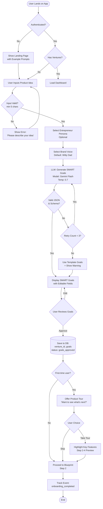
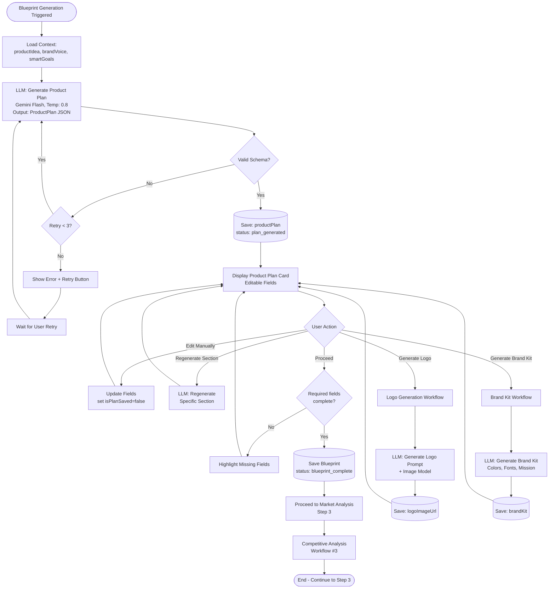
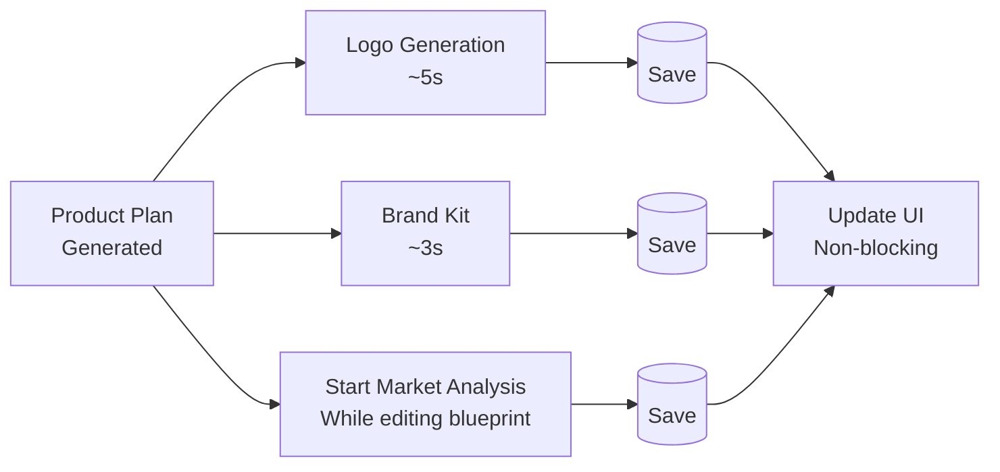
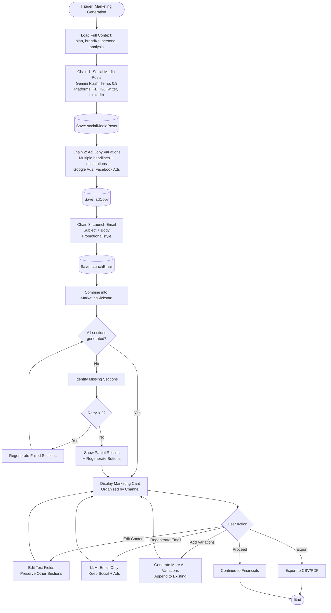
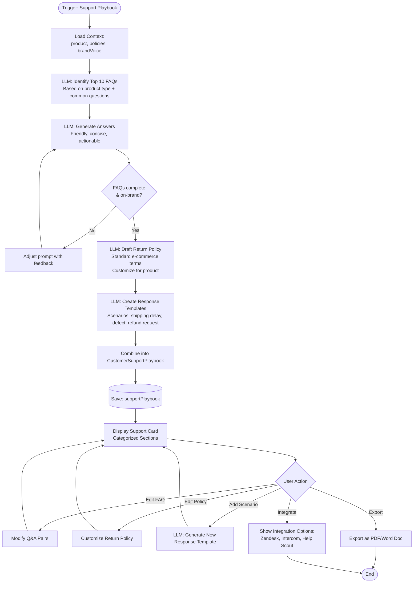
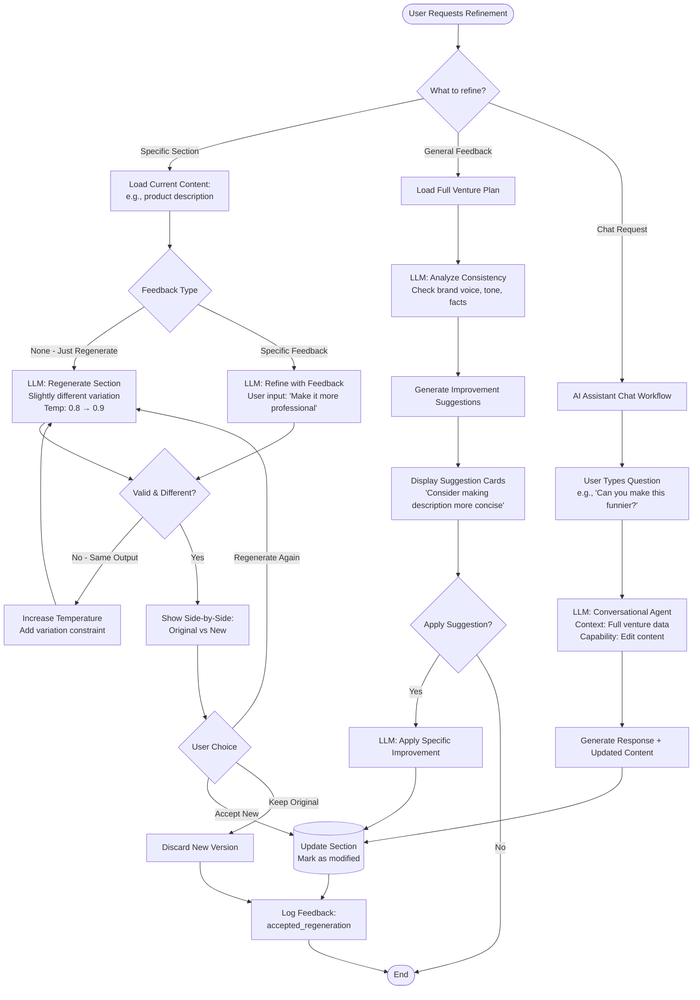
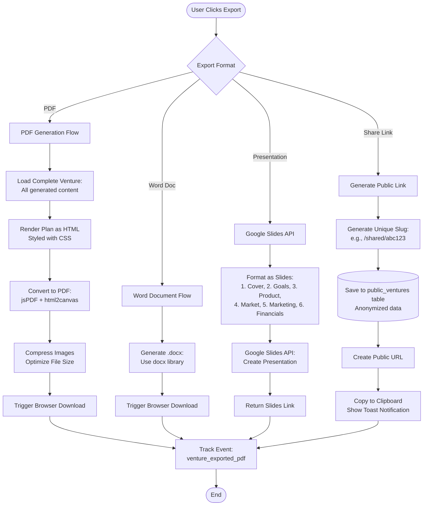

# LLM-Enabled Workflows

## Overview
This document defines the key LLM-powered workflows in the E-commerce Plan Generator SaaS MVP, expressed as step-by-step sequences with Mermaid flow diagrams. Each workflow includes input triggers, prompt stages, decision points, and data persistence checkpoints.

---

## Workflow Index

1. **User Onboarding Workflow** - First-time user experience with AI guidance
2. **Venture Creation Workflow** - End-to-end product plan generation
3. **Competitive Analysis Workflow** - Market research with grounded search
4. **Marketing Content Generation Workflow** - Multi-channel content creation
5. **Customer Support Automation Workflow** - AI-powered help and FAQs
6. **Plan Refinement Workflow** - Iterative improvement with user feedback
7. **Export & Delivery Workflow** - PDF generation and sharing

---

## 1. User Onboarding Workflow

### Purpose
Guide new users through their first venture creation with AI-powered tips and personalized recommendations.

### Trigger
- User signs up or starts first venture without account

### Workflow Steps



### Key Decision Points

1. **Input Validation**: Ensures minimum viable product description
2. **Schema Validation**: Verifies LLM output matches expected format
3. **Retry Logic**: Up to 3 attempts before fallback to template
4. **User Review**: Human-in-the-loop approval before proceeding

### Data Persistence Checkpoints

| Checkpoint | Data Saved | Status |
|------------|------------|--------|
| After SMART Goals | `productIdea`, `brandVoice`, `smartGoals` | `goals_approved` |
| First-time flag | User metadata: `completedOnboarding: true` | - |

### Prompting Strategy

**Framework**: Conversational + Guided Workflow

**Prompt Template**:
```yaml
systemPrompt: |
  You are a supportive business mentor guiding a first-time entrepreneur.
  Be encouraging but realistic. Use simple language. Provide actionable advice.

userPrompt: |
  Product idea: {{productIdea}}
  Entrepreneur type: {{personaType}}
  
  Generate SMART goals that are:
  1. Specific to this exact product
  2. Measurable with clear metrics (e.g., "Sell 100 units in first month")
  3. Achievable for a first-time entrepreneur with limited budget
  4. Relevant to e-commerce success
  5. Time-bound with realistic deadlines (1-6 months)
  
  Return as JSON matching this schema: {...}
```

---

## 2. Venture Creation Workflow

### Purpose
Full end-to-end workflow from product idea to complete business plan with all AI-generated components.

### Trigger
- User completes SMART goals and clicks "Build Your Blueprint"

### Workflow Diagram



### Parallel Generation Options

Users can trigger multiple generations simultaneously:



### Data Persistence Checkpoints

| Checkpoint | Data Saved | Triggers |
|------------|------------|----------|
| Product Plan Generated | `productPlan` (title, description, variants, pricing) | `plan_generated` event |
| Logo Generated | `logoImageUrl` | `logo_generated` event |
| Brand Kit Generated | `brandKit` (colors, fonts, mission) | `brand_kit_generated` event |
| Blueprint Complete | All above + validation flag | `blueprint_complete` event |

### Validation Rules

```typescript
interface BlueprintValidation {
  productTitle: string;        // Required, min 3 chars
  description: string;          // Required, min 50 chars
  priceCents: number;           // Required, > 0
  sku: string;                  // Required, unique format
  variants?: ProductVariant[];  // Optional, validate each if present
  tags: string[];              // Required, min 1 tag
}

function validateBlueprint(plan: ProductPlan): ValidationResult {
  const errors: string[] = [];
  
  if (!plan.productTitle || plan.productTitle.length < 3) {
    errors.push('Product title must be at least 3 characters');
  }
  
  if (!plan.description || plan.description.length < 50) {
    errors.push('Description must be at least 50 characters');
  }
  
  if (plan.priceCents <= 0) {
    errors.push('Price must be greater than $0');
  }
  
  if (!plan.sku || !/^[A-Z0-9-]+$/.test(plan.sku)) {
    errors.push('SKU must contain only uppercase letters, numbers, and hyphens');
  }
  
  if (plan.variants) {
    plan.variants.forEach((v, i) => {
      if (v.priceCents <= 0) {
        errors.push(`Variant ${i+1} price must be greater than $0`);
      }
    });
  }
  
  if (plan.tags.length === 0) {
    errors.push('At least one tag is required for categorization');
  }
  
  return {
    valid: errors.length === 0,
    errors
  };
}
```

---

## 3. Competitive Analysis Workflow

### Purpose
Generate market research with real competitor data using Google Search grounding to minimize hallucinations.

### Trigger
- User navigates to Step 3 (Market Analysis)
- User clicks "Generate Competitive Analysis"

### Workflow Diagram

```mermaid
flowchart TD
    Start([Trigger: Generate Analysis]) --> LoadContext[Load Context:<br/>productIdea, productPlan, targetMarket]
    
    LoadContext --> BuildQuery[Build Search Query<br/>'{{product}} competitors market analysis']
    
    BuildQuery --> LLM_Grounded[LLM: Gemini Pro with Grounding<br/>Enable Google Search<br/>Temperature: 0.5]
    
    LLM_Grounded --> ProcessGrounding{Grounding Sources<br/>Available?}
    
    ProcessGrounding -->|Yes| ExtractSources[Extract Source URLs<br/>Parse Competitor Data]
    ProcessGrounding -->|No| LowConfidence[Flag: Low Confidence<br/>Add Disclaimer]
    
    ExtractSources --> ValidateCompetitors{At least 3<br/>competitors found?}
    LowConfidence --> ValidateCompetitors
    
    ValidateCompetitors -->|No| RetrySearch{Retry < 2?}
    RetrySearch -->|Yes| BroadenQuery[Broaden Search Query<br/>Remove specific keywords]
    BroadenQuery --> LLM_Grounded
    
    RetrySearch -->|No| FallbackCompetitors[Use Generic Analysis<br/>Show Warning]
    
    ValidateCompetitors -->|Yes| CalculateOpportunity[Calculate Opportunity Score<br/>Based on: market size, competition, differentiation]
    
    FallbackCompetitors --> CalculateOpportunity
    
    CalculateOpportunity --> GenerateDiff[Generate Differentiation<br/>Strategies]
    
    GenerateDiff --> FormatOutput[Format as CompetitiveAnalysis<br/>JSON]
    
    FormatOutput --> SaveAnalysis[(Save: analysis<br/>status: analysis_complete<br/>sources: groundingUrls)]
    
    SaveAnalysis --> DisplayResults[Display Analysis Card<br/>with Source Citations]
    
    DisplayResults --> UserReview{User Action}
    UserReview -->|Regenerate| Start
    UserReview -->|Edit| ManualEdit[Allow Field Editing<br/>Preserve Sources]
    UserReview -->|Accept| NextStep[Continue to SWOT Analysis]
    
    ManualEdit --> DisplayResults
    NextStep --> End([End])
```

### Grounding Strategy

**Why Google Search Grounding?**
- ✅ Reduces hallucinations for competitor names and pricing
- ✅ Provides verifiable sources for claims
- ✅ Keeps data current (not limited to training cutoff)
- ⚠️ Higher latency (~8-12 seconds vs 3-5 seconds)
- ⚠️ Requires Gemini Pro (more expensive)

**Search Query Construction:**
```typescript
function buildSearchQuery(context: {
  productIdea: string;
  category?: string;
  targetMarket?: string;
}): string {
  const queries = [
    `${context.productIdea} competitors`,
    `${context.productIdea} market analysis`,
    `top ${context.category} brands 2024`,
  ];
  
  if (context.targetMarket) {
    queries.push(`${context.productIdea} ${context.targetMarket} market`);
  }
  
  return queries.join(' OR ');
}
```

**Prompt with Grounding:**
```yaml
model: gemini-1.5-pro
temperature: 0.5
enableGrounding: true
groundingConfig:
  sources: ['google_search']
  dynamicRetrievalConfig:
    mode: 'MODE_DYNAMIC'
    dynamicThreshold: 0.7

systemPrompt: |
  You are a market research analyst. Use current web data to provide accurate competitor information.
  
  CRITICAL: Only include competitors you found in search results. Never invent company names or data.
  If you cannot find 3 competitors, return what you found and flag lowConfidence: true.

userPrompt: |
  Product: {{productIdea}}
  Category: {{category}}
  
  Research and analyze:
  1. Top 3-5 competitors in this market
  2. Current market trends and size
  3. Pricing ranges
  4. Unique selling propositions
  
  For each competitor, provide:
  - Exact company name (from search results)
  - Price range (if available)
  - 2-3 strengths
  - 2-3 weaknesses
  
  Calculate an opportunity score (0-100) based on:
  - Market saturation (lower = better opportunity)
  - Differentiation potential (higher = better)
  - Barriers to entry (lower = better)
  
  Output JSON with sources array containing URLs used.
```

### Opportunity Score Calculation

```typescript
interface OpportunityFactors {
  marketSaturation: number;      // 0-10 (0 = blue ocean, 10 = saturated)
  differentiationPotential: number; // 0-10 (10 = highly unique)
  competitorWeaknesses: number;  // 0-10 (10 = many weaknesses)
  barrierToEntry: number;        // 0-10 (0 = easy to enter, 10 = hard)
  marketGrowth: number;          // 0-10 (10 = rapidly growing)
}

function calculateOpportunityScore(factors: OpportunityFactors): number {
  const weights = {
    marketSaturation: -0.25,      // Negative: lower saturation = higher score
    differentiationPotential: 0.30,
    competitorWeaknesses: 0.20,
    barrierToEntry: -0.10,         // Negative: lower barrier = higher score
    marketGrowth: 0.25
  };
  
  let score = 50; // Start at midpoint
  
  score += factors.marketSaturation * weights.marketSaturation * 10;
  score += factors.differentiationPotential * weights.differentiationPotential * 10;
  score += factors.competitorWeaknesses * weights.competitorWeaknesses * 10;
  score += factors.barrierToEntry * weights.barrierToEntry * 10;
  score += factors.marketGrowth * weights.marketGrowth * 10;
  
  return Math.max(0, Math.min(100, Math.round(score)));
}
```

### Data Validation

```typescript
interface ValidationChecks {
  hasMinCompetitors: boolean;    // At least 3 competitors
  hasOpportunityScore: boolean;   // Score is 0-100
  hasSources: boolean;            // Grounding sources present
  noPlaceholders: boolean;        // No "[Insert X]" text
  validPriceFormats: boolean;     // Prices match regex
}

function validateAnalysis(analysis: CompetitiveAnalysis): ValidationChecks {
  return {
    hasMinCompetitors: analysis.competitors.length >= 3,
    hasOpportunityScore: analysis.opportunityScore >= 0 && 
                         analysis.opportunityScore <= 100,
    hasSources: analysis.sources && analysis.sources.length > 0,
    noPlaceholders: !JSON.stringify(analysis).includes('[Insert'),
    validPriceFormats: analysis.competitors.every(c => 
      /^\$[\d,]+-\$[\d,]+$/.test(c.estimatedPriceRange)
    )
  };
}
```

---

## 4. Marketing Content Generation Workflow

### Purpose
Generate multi-channel marketing content (social posts, ad copy, email campaigns) in a single coordinated workflow.

### Trigger
- User navigates to Step 4 (Launchpad)
- User clicks "Generate Marketing Kickstart"

### Workflow Diagram



### Prompt Chaining Strategy

**Why Chain Prompts?**
- Each content type has different tone and format requirements
- Prevents overwhelming single prompt with too many instructions
- Allows regeneration of individual sections
- Better error isolation

**Chain Sequence:**

1. **Social Media Posts** (Creative, high variation)
```yaml
temperature: 0.9
maxTokens: 1500

prompt: |
  Generate 4 social media posts for {{productTitle}}:
  
  1. Facebook: Friendly, benefit-focused, 2-3 sentences + emoji
  2. Instagram: Visual description, aspirational, 1-2 sentences + 5-10 hashtags
  3. Twitter: Punchy, 1 sentence + link placeholder, under 280 chars
  4. LinkedIn: Professional, industry insight angle, 3-4 sentences
  
  Brand voice: {{brandVoice}}
  Key features: {{features}}
  Target audience: {{customerPersona.demographics}}
  
  Output as JSON array with platform, postTextVariations, hashtags, visualPrompt.
```

2. **Ad Copy Variations** (Structured, conversion-focused)
```yaml
temperature: 0.8
maxTokens: 2000

prompt: |
  Generate ad copy for {{productTitle}} for testing:
  
  Platform: Google Ads
  - 3 headline variations (30 chars each, benefit-driven)
  - 2 description variations (90 chars each, action-oriented)
  - Audience targeting notes (demographics, interests, keywords)
  
  Platform: Facebook Ads
  - 3 headline variations (short, attention-grabbing)
  - 2 description variations (problem → solution format)
  - Audience targeting notes
  
  Brand voice: {{brandVoice}}
  USP: {{differentiationStrategies}}
  
  Output as JSON array matching AdCopy interface.
```

3. **Launch Email** (Narrative, promotional)
```yaml
temperature: 0.7
maxTokens: 1000

prompt: |
  Write a product launch email for {{productTitle}}:
  
  Structure:
  - Subject line: Curiosity-driven, under 50 chars
  - Greeting: Warm, personal
  - Hook: Problem statement (2 sentences)
  - Solution: Introduce product with 1-2 key benefits
  - Social proof: Mention testing/validation if available
  - CTA: Clear action (pre-order, learn more, etc.)
  - Sign-off: Brand voice consistent
  
  Tone: {{brandVoice}}
  Length: 150-200 words
  
  Output as JSON: { subject, body }
```

### Parallel Execution Option

For faster generation, execute chains in parallel:

```typescript
async function generateMarketingKickstartParallel(context: Context) {
  const [socialPosts, adCopy, launchEmail] = await Promise.all([
    generateSocialMediaPosts(context),
    generateAdCopy(context),
    generateLaunchEmail(context)
  ]);
  
  return {
    socialMediaPosts: socialPosts,
    adCopy: adCopy,
    launchEmail: launchEmail
  };
}
```

**Trade-off**: Parallel = faster (5-8s total) but 3x API calls simultaneously  
**Sequential**: Slower (15-20s total) but better rate limit management

---

## 5. Customer Support Automation Workflow

### Purpose
Generate AI-powered customer support resources: FAQs, return policies, response templates.

### Trigger
- User clicks "Generate Support Playbook" in Launchpad
- Can also be triggered during venture setup

### Workflow Diagram



### FAQ Generation Strategy

**Prompt Design:**
```yaml
model: gemini-1.5-flash
temperature: 0.6

systemPrompt: |
  You are a customer support specialist creating a FAQ section for an e-commerce product.
  
  Rules:
  - Keep answers under 100 words
  - Be helpful and empathetic
  - Include specific details when possible (e.g., "Ships within 2-3 business days" not "Ships soon")
  - Match the brand voice tone
  - End with a call-to-action when appropriate (e.g., "Contact us if you need help!")

userPrompt: |
  Product: {{productTitle}}
  Category: {{category}}
  Price: {{price}}
  Shipping: {{shippingOptions}}
  Return policy: {{returnPolicy}}
  Brand voice: {{brandVoice}}
  
  Generate the top 10 FAQs customers would ask about this product, including:
  - 2-3 questions about shipping and delivery
  - 2-3 questions about returns and refunds
  - 2-3 questions about product details and usage
  - 1-2 questions about ordering and payment
  
  Output as JSON array: [{ question: string, answer: string }]
```

**Sample Output:**
```json
{
  "faq": [
    {
      "question": "How long does shipping take?",
      "answer": "We ship within 2-3 business days via USPS Priority Mail. Most orders arrive within 5-7 business days in the continental US. You'll get a tracking number as soon as your order ships!"
    },
    {
      "question": "What if my order arrives damaged?",
      "answer": "We're so sorry if that happens! Just email us a photo within 7 days at support@example.com and we'll send a replacement right away, no questions asked. Your satisfaction is our priority."
    }
    // ... 8 more
  ]
}
```

### Response Template Scenarios

Common scenarios to generate templates for:

1. **Shipping Delay**
   ```
   Scenario: Customer asks where their order is (shipped 5 days ago)
   Template: Acknowledge, check tracking, provide update, offer resolution
   ```

2. **Product Defect**
   ```
   Scenario: Customer reports product doesn't work as expected
   Template: Apologize, gather details, offer replacement or refund
   ```

3. **Refund Request**
   ```
   Scenario: Customer wants to return for refund within policy window
   Template: Confirm policy, provide return instructions, set expectations
   ```

4. **Pre-Sale Question**
   ```
   Scenario: Potential customer asks about product compatibility/sizing
   Template: Provide detailed answer, link to resources, encourage purchase
   ```

---

## 6. Plan Refinement Workflow

### Purpose
Iteratively improve generated content based on user feedback and AI suggestions.

### Trigger
- User clicks "Regenerate" on any section
- User provides feedback (thumbs down on generated content)
- User asks AI assistant for improvements

### Workflow Diagram



### Regeneration Strategies

**Strategy 1: Increase Randomness**
```typescript
async function regenerateWithVariation(
  originalContent: string,
  promptTemplate: string,
  attempt: number
) {
  const temperature = 0.7 + (attempt * 0.1); // 0.7, 0.8, 0.9
  
  const prompt = `
    ${promptTemplate}
    
    IMPORTANT: Generate a different variation than this:
    "${originalContent.substring(0, 200)}..."
    
    Focus on a different angle or approach.
  `;
  
  return await callLLM(prompt, { temperature });
}
```

**Strategy 2: Explicit Feedback Loop**
```typescript
async function refineWithFeedback(
  currentContent: string,
  userFeedback: string,
  context: VentureContext
) {
  const prompt = `
    Current content:
    "${currentContent}"
    
    User feedback: "${userFeedback}"
    
    Revise the content to address the feedback while maintaining:
    - Brand voice: ${context.brandVoice}
    - Key information: ${context.keyPoints}
    - Original structure and format
    
    Output the improved version.
  `;
  
  return await callLLM(prompt, { temperature: 0.7 });
}
```

### Feedback Collection & Learning

```typescript
interface RefinementFeedback {
  originalContent: string;
  revisedContent: string;
  userAction: 'accepted' | 'rejected' | 'edited_further';
  feedbackText?: string;
  timestamp: string;
  sectionType: string;  // e.g., 'product_description'
}

async function logRefinement(feedback: RefinementFeedback) {
  // Store in database for analysis
  await supabase.from('refinement_feedback').insert(feedback);
  
  // Track in observability platform
  langfuse.score({
    name: 'regeneration_outcome',
    value: feedback.userAction === 'accepted' ? 1 : 0,
    metadata: { sectionType: feedback.sectionType }
  });
}

// Later: Analyze patterns to improve prompts
async function analyzeRefinementPatterns() {
  const { data } = await supabase
    .from('refinement_feedback')
    .select('*')
    .eq('userAction', 'rejected')
    .limit(100);
  
  // LLM analysis: What patterns lead to rejection?
  const patterns = await analyzeFeedbackWithLLM(data);
  
  // Update prompt templates based on insights
  await updatePromptTemplates(patterns);
}
```

---

## 7. Export & Delivery Workflow

### Purpose
Package generated venture plan into shareable formats (PDF, Word, presentation).

### Trigger
- User clicks "Export as PDF" or "Download Plan"
- User clicks "Share" to get public link

### Workflow Diagram



### PDF Generation Implementation

**Current Implementation** (using jsPDF + html2canvas):
```typescript
import html2canvas from 'html2canvas';
import jsPDF from 'jspdf';

async function exportToPDF(ventureData: AppData) {
  // 1. Render venture plan as HTML
  const element = document.getElementById('venture-plan-printable');
  
  // 2. Capture as image
  const canvas = await html2canvas(element, {
    scale: 2,  // Higher quality
    useCORS: true,  // Load external images
    backgroundColor: '#ffffff'
  });
  
  // 3. Convert to PDF
  const imgData = canvas.toDataURL('image/png');
  const pdf = new jsPDF({
    orientation: 'portrait',
    unit: 'mm',
    format: 'a4'
  });
  
  const imgWidth = 210; // A4 width in mm
  const imgHeight = (canvas.height * imgWidth) / canvas.width;
  
  pdf.addImage(imgData, 'PNG', 0, 0, imgWidth, imgHeight);
  
  // 4. Download
  pdf.save(`${ventureData.plan.productTitle}-business-plan.pdf`);
  
  // 5. Track event
  trackEvent('venture_exported_pdf', {
    ventureId: ventureData.ventureId,
    pageCounts: pdf.getNumberOfPages()
  });
}
```

**Enhanced PDF Generation** (with better formatting):
```typescript
async function exportToPDFEnhanced(ventureData: AppData) {
  const pdf = new jsPDF();
  let yPosition = 20;
  
  // Cover page
  pdf.setFontSize(24);
  pdf.text(ventureData.plan.productTitle, 20, yPosition);
  yPosition += 15;
  
  pdf.setFontSize(12);
  pdf.text('Business Plan', 20, yPosition);
  yPosition += 30;
  
  // SMART Goals section
  pdf.setFontSize(16);
  pdf.text('SMART Goals', 20, yPosition);
  yPosition += 10;
  
  pdf.setFontSize(10);
  Object.entries(ventureData.smartGoals).forEach(([key, goal]) => {
    pdf.text(`${key.toUpperCase()}:`, 20, yPosition);
    yPosition += 6;
    const lines = pdf.splitTextToSize(goal.description, 170);
    pdf.text(lines, 25, yPosition);
    yPosition += lines.length * 5 + 5;
    
    if (yPosition > 270) {
      pdf.addPage();
      yPosition = 20;
    }
  });
  
  // Add more sections...
  
  // Financials with chart
  if (ventureData.financials) {
    pdf.addPage();
    pdf.text('Financial Projections', 20, 20);
    
    // Add chart as image
    const chartElement = document.getElementById('financial-chart');
    if (chartElement) {
      const chartCanvas = await html2canvas(chartElement);
      const chartImg = chartCanvas.toDataURL('image/png');
      pdf.addImage(chartImg, 'PNG', 20, 30, 170, 100);
    }
  }
  
  // Footer on each page
  const pageCount = pdf.getNumberOfPages();
  for (let i = 1; i <= pageCount; i++) {
    pdf.setPage(i);
    pdf.setFontSize(8);
    pdf.text(
      `Generated by E-commerce Plan Generator | Page ${i} of ${pageCount}`,
      20,
      pdf.internal.pageSize.height - 10
    );
  }
  
  pdf.save(`${ventureData.plan.productTitle}-plan.pdf`);
}
```

### Public Sharing Implementation

```typescript
// Generate shareable link
async function createPublicLink(venture: SavedVenture): Promise<string> {
  const slug = generateSlug(); // e.g., 'organic-dog-treats-a3b9f2'
  
  // Anonymize data (remove personal info)
  const publicData = {
    productIdea: venture.data.productIdea,
    plan: venture.data.plan,
    brandKit: venture.data.brandKit,
    analysis: venture.data.analysis,
    // Exclude: user ID, private notes, supplier contacts
  };
  
  // Save to public table with expiration
  const { error } = await supabase.from('public_ventures').insert({
    slug,
    data: publicData,
    expires_at: new Date(Date.now() + 30 * 24 * 60 * 60 * 1000) // 30 days
  });
  
  if (error) throw error;
  
  const publicUrl = `${window.location.origin}/shared/${slug}`;
  
  // Track event
  trackEvent('venture_shared', {
    ventureId: venture.id,
    slug
  });
  
  return publicUrl;
}

// View shared venture (public route)
async function loadPublicVenture(slug: string) {
  const { data, error } = await supabase
    .from('public_ventures')
    .select('*')
    .eq('slug', slug)
    .single();
  
  if (error || !data) {
    throw new Error('Venture not found or expired');
  }
  
  // Check expiration
  if (new Date(data.expires_at) < new Date()) {
    throw new Error('This link has expired');
  }
  
  return data.data;
}
```

---

## Workflow Summary Table

| Workflow | Avg Time | LLM Calls | Cost/Run | Critical Path |
|----------|----------|-----------|----------|---------------|
| **Onboarding** | 3-5s | 1 (SMART Goals) | $0.001 | Input validation → Goals generation → Save |
| **Venture Creation** | 8-15s | 3-5 (Plan, Logo, Brand Kit) | $0.008 | Product plan → Validate → Optional enhancements |
| **Competitive Analysis** | 10-15s | 1 (with grounding) | $0.015 | Search query → Grounded LLM → Extract sources |
| **Marketing Content** | 15-20s | 3 (Social, Ads, Email) | $0.007 | Parallel chains → Combine → Validate |
| **Support Playbook** | 8-12s | 2 (FAQs, Templates) | $0.004 | Generate FAQs → Generate responses |
| **Refinement** | 3-5s | 1 (regeneration) | $0.002 | Load context → Regenerate → Compare |
| **Export PDF** | 2-3s | 0 | $0 | Render HTML → Convert → Download |

**Total Workflow** (Full venture creation): ~50-70 seconds, ~$0.04 total cost

---

## Next Steps

Proceed to:
- Documentation structure (`04-documentation-structure.md`)
- Rollout plan and best practices (`05-rollout-plan.md`)
