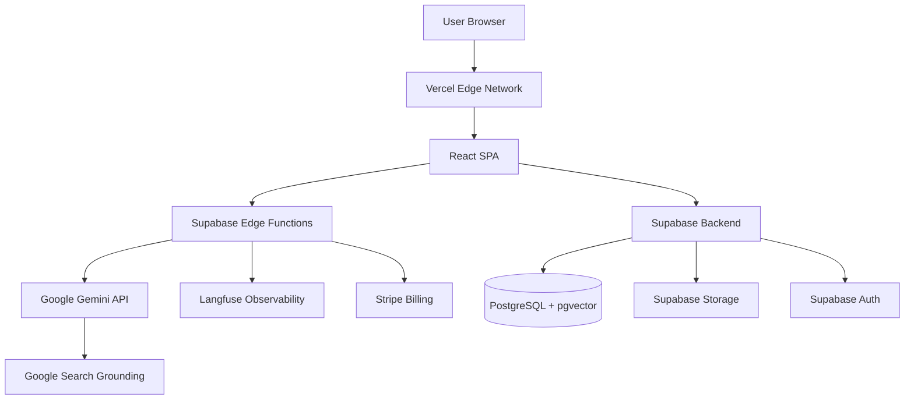
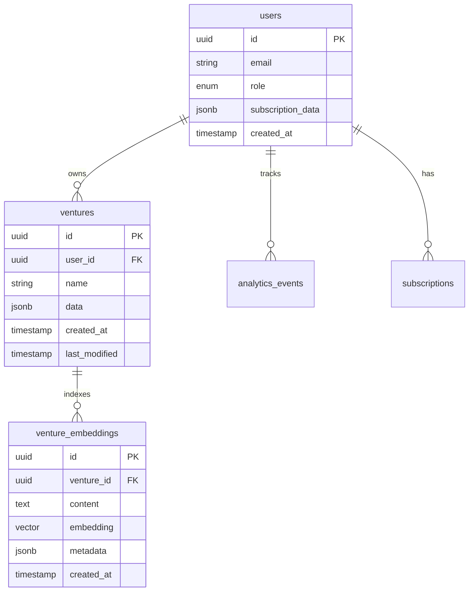

# LLM-Generated Documentation Structure

## Overview
This document defines the comprehensive documentation structure for the LLM-powered E-commerce SaaS MVP, covering technical specifications, API references, user guides, prompt templates, evaluation rubrics, and decision logs.

---

## Documentation Architecture

```
/docs/
├── README.md                          # Documentation hub & navigation
├── /technical-specs/
│   ├── architecture-overview.md       # System architecture
│   ├── data-model.md                  # Database schema & types
│   ├── llm-integration.md             # LLM API integration details
│   ├── authentication-flow.md         # Auth & authorization
│   └── deployment-guide.md            # Production deployment
├── /api-reference/
│   ├── rest-api.md                    # REST endpoints documentation
│   ├── edge-functions.md              # Supabase Edge Functions API
│   ├── llm-service-api.md             # Internal LLM service API
│   └── webhooks.md                    # Webhook specifications
├── /user-guides/
│   ├── getting-started.md             # Quick start guide
│   ├── creating-first-venture.md      # Tutorial: First venture
│   ├── advanced-features.md           # Power user features
│   ├── export-and-sharing.md          # Export & collaboration
│   └── faq.md                         # Frequently asked questions
├── /prompt-engineering/
│   ├── prompt-library.md              # All prompt templates
│   ├── prompt-versioning.md           # Version control strategy
│   ├── testing-guidelines.md          # How to test prompts
│   ├── evaluation-rubric.md           # Quality assessment criteria
│   └── best-practices.md              # Prompt engineering tips
├── /onboarding/
│   ├── new-user-guide.md              # First-time user experience
│   ├── feature-walkthroughs.md        # Interactive tutorials
│   ├── video-transcripts.md           # Training video scripts
│   └── persona-selection-guide.md     # Choosing entrepreneur persona
├── /decision-logs/
│   ├── 001-llm-provider-selection.md  # Why Gemini over GPT-4
│   ├── 002-prompt-versioning-strategy.md
│   ├── 003-rag-implementation.md      # Vector DB decisions
│   └── template.md                    # ADR template
└── /runbooks/
    ├── incident-response.md           # Handling production issues
    ├── prompt-rollback.md             # Reverting bad prompts
    ├── cost-monitoring.md             # LLM cost alerts
    └── performance-optimization.md    # Speed & quality tuning
```

---

## 1. Technical Specifications

### 1.1 Architecture Overview

**Purpose**: High-level system architecture for developers and architects

**Template:**

```markdown
# System Architecture Overview

## Architecture Diagram



## Technology Stack

| Layer | Technology | Version | Purpose |
|-------|-----------|---------|---------|
| **Frontend** | React | 19.2.0 | UI framework |
| **Language** | TypeScript | 5.8.2 | Type safety |
| **Build Tool** | Vite | 6.2.0 | Fast bundling |
| **Styling** | Tailwind CSS | 4.1.17 | Utility-first CSS |
| **LLM Provider** | Google Gemini | 1.5 | Content generation |
| **Backend** | Supabase | 2.90.1 | Database + Auth + Storage |
| **Deployment** | Vercel | Latest | Edge hosting |
| **Observability** | Langfuse | Latest | LLM monitoring |
| **Payments** | Stripe | Latest | Subscription billing |

## Data Flow

### Generation Request Flow
1. User inputs product idea in React UI
2. Frontend calls Supabase Edge Function with context
3. Edge Function validates input + checks rate limits
4. Edge Function constructs prompt from template
5. Edge Function calls Gemini API
6. Edge Function validates & parses LLM response
7. Edge Function logs to Langfuse (usage, latency, cost)
8. Edge Function returns structured data to frontend
9. Frontend saves to Supabase database
10. Frontend updates UI with generated content

### Authentication Flow
1. User signs up/in via Supabase Auth (email/password or OAuth)
2. Frontend stores session in httpOnly cookie
3. All API calls include session token in header
4. Edge Functions verify token with Supabase
5. RLS policies enforce user-scoped data access

## Security Considerations

- ✅ API keys stored in environment variables (not in client code)
- ✅ Rate limiting per user/IP to prevent abuse
- ✅ Input sanitization to prevent prompt injection
- ✅ Output validation to catch malformed responses
- ✅ RLS (Row Level Security) on all database tables
- ✅ CORS configured for allowed origins only
- ✅ HTTPS enforced on all endpoints

## Scalability Approach

- **Horizontal scaling**: Vercel auto-scales Edge Functions
- **Database**: Supabase Pro plan supports 50GB+ with connection pooling
- **LLM API**: Rate limiting + queueing for burst traffic
- **Caching**: Cache frequently generated content (e.g., example ventures)
- **CDN**: Static assets served from Vercel Edge Network

## Monitoring & Alerting

- **Langfuse**: LLM call traces, costs, latency
- **Supabase Dashboard**: Database performance, auth metrics
- **Vercel Analytics**: Page views, Web Vitals, deployment status
- **Sentry** (recommended): Error tracking and alerting

---

*Last updated: 2024-01-15*
*Maintained by: Engineering Team*
```

---

### 1.2 Data Model

**Purpose**: Database schema and TypeScript interfaces

**Template:**

```markdown
# Data Model & Schema

## Entity Relationship Diagram



## PostgreSQL Schema

```sql
-- Enable extensions
CREATE EXTENSION IF NOT EXISTS "uuid-ossp";
CREATE EXTENSION IF NOT EXISTS "vector";

-- Users table (managed by Supabase Auth)
-- Extended with custom profile data
CREATE TABLE user_profiles (
    id UUID PRIMARY KEY REFERENCES auth.users(id) ON DELETE CASCADE,
    role TEXT NOT NULL DEFAULT 'free' CHECK (role IN ('free', 'starter', 'pro', 'admin')),
    subscription_data JSONB DEFAULT '{}'::jsonb,
    completed_onboarding BOOLEAN DEFAULT FALSE,
    preferences JSONB DEFAULT '{}'::jsonb,
    created_at TIMESTAMP WITH TIME ZONE DEFAULT NOW(),
    updated_at TIMESTAMP WITH TIME ZONE DEFAULT NOW()
);

-- Ventures table (main data storage)
CREATE TABLE ventures (
    id UUID PRIMARY KEY DEFAULT uuid_generate_v4(),
    user_id UUID NOT NULL REFERENCES user_profiles(id) ON DELETE CASCADE,
    name TEXT NOT NULL,
    data JSONB NOT NULL,  -- Stores full AppData structure
    status TEXT DEFAULT 'draft' CHECK (status IN ('draft', 'active', 'archived')),
    created_at TIMESTAMP WITH TIME ZONE DEFAULT NOW(),
    last_modified TIMESTAMP WITH TIME ZONE DEFAULT NOW()
);

-- Vector embeddings for RAG
CREATE TABLE venture_embeddings (
    id UUID PRIMARY KEY DEFAULT uuid_generate_v4(),
    venture_id UUID NOT NULL REFERENCES ventures(id) ON DELETE CASCADE,
    content TEXT NOT NULL,
    embedding vector(768),  -- Gemini embedding dimension
    metadata JSONB DEFAULT '{}'::jsonb,
    created_at TIMESTAMP WITH TIME ZONE DEFAULT NOW()
);

-- Analytics events
CREATE TABLE analytics_events (
    id UUID PRIMARY KEY DEFAULT uuid_generate_v4(),
    user_id UUID REFERENCES user_profiles(id) ON DELETE SET NULL,
    event_name TEXT NOT NULL,
    event_data JSONB DEFAULT '{}'::jsonb,
    session_id TEXT,
    created_at TIMESTAMP WITH TIME ZONE DEFAULT NOW()
);

-- LLM usage logs (cost tracking)
CREATE TABLE llm_usage_logs (
    id UUID PRIMARY KEY DEFAULT uuid_generate_v4(),
    user_id UUID REFERENCES user_profiles(id) ON DELETE SET NULL,
    model TEXT NOT NULL,
    prompt_tokens INTEGER NOT NULL,
    completion_tokens INTEGER NOT NULL,
    total_tokens INTEGER NOT NULL,
    cost_usd DECIMAL(10, 6) NOT NULL,
    latency_ms INTEGER,
    feature TEXT,  -- e.g., 'smart_goals', 'product_plan'
    created_at TIMESTAMP WITH TIME ZONE DEFAULT NOW()
);

-- Public shared ventures
CREATE TABLE public_ventures (
    id UUID PRIMARY KEY DEFAULT uuid_generate_v4(),
    slug TEXT UNIQUE NOT NULL,
    data JSONB NOT NULL,
    expires_at TIMESTAMP WITH TIME ZONE NOT NULL,
    view_count INTEGER DEFAULT 0,
    created_at TIMESTAMP WITH TIME ZONE DEFAULT NOW()
);

-- Indexes
CREATE INDEX idx_ventures_user_id ON ventures(user_id);
CREATE INDEX idx_ventures_last_modified ON ventures(last_modified DESC);
CREATE INDEX idx_venture_embeddings_venture_id ON venture_embeddings(venture_id);
CREATE INDEX idx_venture_embeddings_vector ON venture_embeddings USING ivfflat (embedding vector_cosine_ops);
CREATE INDEX idx_analytics_events_user_id ON analytics_events(user_id);
CREATE INDEX idx_analytics_events_created_at ON analytics_events(created_at DESC);
CREATE INDEX idx_llm_usage_user_id ON llm_usage_logs(user_id);
CREATE INDEX idx_public_ventures_slug ON public_ventures(slug);

-- Row Level Security (RLS) Policies
ALTER TABLE user_profiles ENABLE ROW LEVEL SECURITY;
ALTER TABLE ventures ENABLE ROW LEVEL SECURITY;
ALTER TABLE venture_embeddings ENABLE ROW LEVEL SECURITY;
ALTER TABLE analytics_events ENABLE ROW LEVEL SECURITY;
ALTER TABLE llm_usage_logs ENABLE ROW LEVEL SECURITY;

-- Users can only see their own profile
CREATE POLICY "Users can view own profile" ON user_profiles
    FOR SELECT USING (auth.uid() = id);
CREATE POLICY "Users can update own profile" ON user_profiles
    FOR UPDATE USING (auth.uid() = id);

-- Users can only access their own ventures
CREATE POLICY "Users can view own ventures" ON ventures
    FOR SELECT USING (auth.uid() = user_id);
CREATE POLICY "Users can insert own ventures" ON ventures
    FOR INSERT WITH CHECK (auth.uid() = user_id);
CREATE POLICY "Users can update own ventures" ON ventures
    FOR UPDATE USING (auth.uid() = user_id);
CREATE POLICY "Users can delete own ventures" ON ventures
    FOR DELETE USING (auth.uid() = user_id);

-- Similar policies for other tables...
```

## TypeScript Interfaces

See `/types.ts` for complete type definitions. Key interfaces:

```typescript
interface AppData {
    productIdea: string;
    brandVoice: string;
    smartGoals: SMARTGoals | null;
    plan: ProductPlan;
    // ... 30+ more fields
}

interface SavedVenture {
    id: string;
    name: string;
    lastModified: string;
    data: AppData;
}

interface ProductPlan {
    productTitle: string;
    slug: string;
    description: string;
    priceCents: number;
    currency: string;
    sku: string;
    stock: number;
    variants: ProductVariant[];
    tags: string[];
}

// ... see types.ts for all interfaces
```

---

*Last updated: 2024-01-15*
```

---

## 2. API Reference

### 2.1 Edge Functions API

**Purpose**: Document all Supabase Edge Functions for internal and external use

**Template:**

```markdown
# Edge Functions API Reference

## Overview

All Edge Functions are deployed to Supabase and accessible at:
```
https://[project-ref].supabase.co/functions/v1/[function-name]
```

**Authentication**: Include `Authorization: Bearer [JWT_TOKEN]` header

---

## 1. Generate SMART Goals

**Endpoint**: `POST /functions/v1/generate-smart-goals`

**Description**: Generates SMART goals from a product idea using Gemini LLM.

**Request Body**:
```json
{
  "productIdea": "organic dog treats made with local ingredients",
  "brandVoice": "Witty & Humorous Dad"
}
```

**Response** (200 OK):
```json
{
  "specific": {
    "title": "Launch Online Store",
    "description": "Create a Shopify store selling 3 signature dog treat flavors by March 1st"
  },
  "measurable": {
    "title": "First 100 Sales",
    "description": "Achieve 100 unit sales within the first 60 days of launch"
  },
  // ... more goals
}
```

**Error Responses**:
- `400 Bad Request`: Invalid input (productIdea too short)
- `429 Too Many Requests`: Rate limit exceeded (max 10 requests/hour for free tier)
- `500 Internal Server Error`: LLM API failure

**Rate Limits**:
- Free tier: 10 requests/hour
- Starter tier: 50 requests/hour
- Pro tier: Unlimited

**Example Request**:
```typescript
const { data, error } = await supabase.functions.invoke('generate-smart-goals', {
  body: {
    productIdea: 'organic dog treats',
    brandVoice: 'Professional'
  }
});
```

---

## 2. Generate Product Plan

**Endpoint**: `POST /functions/v1/generate-product-plan`

**Description**: Creates a complete product plan including title, description, pricing, SKU, variants, and tags.

**Request Body**:
```json
{
  "productIdea": "organic dog treats",
  "brandVoice": "Witty & Humorous Dad",
  "previousFeedback": []  // Optional: array of feedback strings for refinement
}
```

**Response** (200 OK):
```json
{
  "productTitle": "Bark Bites Organic Dog Treats",
  "slug": "bark-bites-organic-treats",
  "description": "Keep your pup's tail wagging with our all-natural, locally-sourced organic dog treats...",
  "priceCents": 1999,
  "currency": "USD",
  "sku": "BARK-001",
  "stock": 100,
  "variants": [
    {
      "title": "Peanut Butter Bliss - 8oz",
      "sku": "BARK-PB-8",
      "priceCents": 1999,
      "stock": 50
    }
  ],
  "tags": ["organic", "dog treats", "healthy pets", "local ingredients"]
}
```

**Validation**: Output is validated against `ProductPlan` schema before returning.

---

## 3. Generate Competitive Analysis (with Grounding)

**Endpoint**: `POST /functions/v1/generate-competitive-analysis`

**Description**: Performs market research using Google Search grounding to find real competitors and market data.

**Request Body**:
```json
{
  "productIdea": "organic dog treats",
  "productPlan": { /* ProductPlan object */ },
  "targetMarket": "health-conscious pet owners in urban areas"  // Optional
}
```

**Response** (200 OK):
```json
{
  "opportunityScore": 78,
  "marketSummary": "The organic pet treat market is growing at 15% annually...",
  "competitors": [
    {
      "name": "Open Farm",
      "estimatedPriceRange": "$15-$25",
      "strengths": ["Established brand", "Wide distribution"],
      "weaknesses": ["Higher price point", "Limited local sourcing"]
    }
    // ... more competitors
  ],
  "differentiationStrategies": [
    "Emphasize local sourcing and community partnerships",
    "Offer subscription model with personalized treat selection"
  ],
  "sources": [
    {
      "uri": "https://example.com/pet-market-report",
      "title": "2024 Organic Pet Food Market Analysis"
    }
  ]
}
```

**Note**: This endpoint uses Gemini Pro (more expensive) due to grounding requirements. Response time: 8-15 seconds.

---

## 4. Stripe Webhook Handler

**Endpoint**: `POST /functions/v1/stripe-webhook`

**Description**: Handles Stripe subscription events (create, update, cancel).

**Authentication**: Verified via Stripe webhook signature

**Events Handled**:
- `customer.subscription.created`: Upgrade user to paid tier
- `customer.subscription.updated`: Modify user's plan
- `customer.subscription.deleted`: Downgrade to free tier
- `invoice.payment_failed`: Send notification, grace period

**Response** (200 OK):
```json
{
  "received": true
}
```

**Internal Actions**: Updates `user_profiles.subscription_data` based on event type.

---

*Last updated: 2024-01-15*
```

---

## 3. User Onboarding & Training Guides

### 3.1 Getting Started Guide

**Purpose**: Help new users create their first venture in under 5 minutes

**Template:**

```markdown
# Getting Started with E-commerce Plan Generator

Welcome! In just a few minutes, you'll have a complete business plan for your e-commerce product idea.

## Quick Start (5 minutes)

### Step 1: Sign Up (30 seconds)

1. Click **"Get Started"** on the homepage
2. Sign up with email/password or continue with Google/GitHub
3. Verify your email (check spam folder if needed)

**Tip**: You can skip signup and try as a guest, but your plans won't be saved to the cloud.

---

### Step 2: Enter Your Product Idea (1 minute)

1. On the **"Idea & Goals"** page, describe your product idea
   - Example: *"Handmade ceramic planters for succulents"*
   - Be specific! Include what makes your product unique.

2. Choose a **Brand Voice**:
   - **Witty & Humorous Dad**: Fun, approachable, dad jokes
   - **Professional**: Serious, data-driven, business-like
   - **Casual Friend**: Warm, conversational, helpful

3. (Optional) Select an **Entrepreneur Persona** that matches your situation:
   - Side Hustle Dad, Dropshipping Newbie, Artisan Maker, etc.
   - This customizes AI recommendations for your experience level

4. Click **"Generate SMART Goals"**

---

### Step 3: Review Your SMART Goals (30 seconds)

The AI will generate 5 specific, measurable goals for your venture:

- **Specific**: Clear, well-defined target
- **Measurable**: Quantifiable milestones
- **Achievable**: Realistic for your resources
- **Relevant**: Aligned with e-commerce success
- **Time-bound**: Deadlines to keep you accountable

**You can edit any goal** by clicking the text fields.

When satisfied, click **"Build Your Blueprint"** to continue.

---

### Step 4: Generate Your Product Plan (2 minutes)

The AI creates:
- ✅ Product title and catchy description
- ✅ Pricing strategy and SKU
- ✅ Product variants (sizes, colors, bundles)
- ✅ Relevant tags for categorization

**Pro tip**: Click the ⟳ icon next to any section to regenerate just that part.

Optional enhancements:
- **Generate Logo**: AI creates a logo prompt (requires separate image generation)
- **Generate Brand Kit**: Get color palette, fonts, and mission statement

---

### Step 5: Explore Market Analysis (1 minute)

Navigate to **Step 3: Market Analysis** to generate:
- **Competitive Analysis**: Real competitors found via Google Search
- **SWOT Analysis**: Strengths, weaknesses, opportunities, threats
- **Customer Persona**: Detailed profile of your ideal customer

Each section generates independently—click to expand and generate.

---

### Step 6: Launch Your Plan (30 seconds)

In **Step 4: Launchpad**, generate:
- Marketing copy (social posts, ads, email campaigns)
- Financial projections (costs, revenue, break-even)
- Action items and next steps

**Save your plan** by clicking the 💾 icon (top right). You can return anytime to edit!

---

## What's Next?

### Export Your Plan
- Click **"Export as PDF"** to download a professional business plan
- Share a public link with investors or collaborators

### Refine with AI Chat
- Use the chat assistant to ask questions or request changes
- Example: *"Can you make the description more technical?"*

### Track Multiple Ventures
- Click **"My Ventures"** to see all your saved plans
- Create new ventures or load previous ones

---

## Tips for Best Results

✅ **Be specific** with your product idea (not just "shoes", but "vegan leather hiking boots for women")  
✅ **Provide context** like target audience, price range, or unique features  
✅ **Iterate**: Regenerate sections until you're happy with the output  
✅ **Edit freely**: AI is a starting point—customize to match your vision  
✅ **Save often**: Don't lose your work!  

---

## Need Help?

- 📖 Read the [Full User Guide](./advanced-features.md)
- 💬 Join our community Discord
- 📧 Email support@ecommerceplanner.com

Happy planning! 🚀
```

---

## 4. Prompt Engineering Documentation

### 4.1 Prompt Library

**Purpose**: Central repository of all prompt templates with versioning

**Template:**

```markdown
# Prompt Library

## Overview
This document catalogs all prompt templates used in production, including version history, performance metrics, and usage guidelines.

---

## 1. SMART Goals Generation

**Current Version**: v1.2.0  
**Model**: gemini-1.5-flash  
**Temperature**: 0.7  
**Last Updated**: 2024-01-15  
**Performance**: 96.8% success rate, avg 3.2s latency, $0.001 per call

### Prompt Template

```yaml
version: "1.2.0"
model: "gemini-1.5-flash"
temperature: 0.7
maxTokens: 1500

systemPrompt: |
  You are a business strategy expert helping entrepreneurs define SMART goals for e-commerce ventures.
  
  SMART criteria:
  - Specific: Clear, well-defined goal with concrete details
  - Measurable: Quantifiable metrics (numbers, dates, percentages)
  - Achievable: Realistic given typical first-time entrepreneur resources
  - Relevant: Directly contributes to e-commerce business success
  - Time-bound: Specific deadline or timeframe (usually 1-6 months)
  
  Important guidelines:
  - Be encouraging but realistic
  - Use specific numbers (e.g., "100 sales" not "many sales")
  - Consider limited budget and time of first-time entrepreneurs
  - Avoid jargon; use simple, clear language
  - Each goal should be 1-2 sentences

userPrompt: |
  Product idea: {{productIdea}}
  Brand voice: {{brandVoice}}
  Entrepreneur experience: {{experienceLevel | default: "first-time"}}
  
  Generate 5 SMART goals for launching this e-commerce product. Each goal should be tailored to this specific product and realistic for a first-time entrepreneur.
  
  Return as JSON matching this exact schema:
  {
    "specific": {
      "title": "Short title (3-5 words)",
      "description": "Specific goal description (1-2 sentences, under 150 characters)"
    },
    "measurable": { "title": "...", "description": "..." },
    "achievable": { "title": "...", "description": "..." },
    "relevant": { "title": "...", "description": "..." },
    "timeBound": { "title": "...", "description": "..." }
  }
  
  Ensure every description includes concrete numbers or dates.
```

### Variables

| Variable | Type | Required | Example |
|----------|------|----------|---------|
| `productIdea` | string | Yes | "organic dog treats" |
| `brandVoice` | enum | Yes | "Witty & Humorous Dad" |
| `experienceLevel` | string | No | "first-time" (default) |

### Example Input/Output

**Input**:
```json
{
  "productIdea": "subscription box for vintage vinyl records",
  "brandVoice": "Casual Friend"
}
```

**Output**:
```json
{
  "specific": {
    "title": "Launch Online Subscription",
    "description": "Create a website with subscription sign-up by March 15th offering 3 vinyl box tiers (Classic Hits, Deep Cuts, Collector's Edition)"
  },
  "measurable": {
    "title": "50 Subscribers in Month 1",
    "description": "Reach 50 paying subscribers within the first 30 days after launch"
  }
  // ... etc
}
```

### Version History

| Version | Date | Changes | Performance Impact |
|---------|------|---------|-------------------|
| v1.2.0 | 2024-01-15 | Added explicit character limits to reduce verbose outputs | -8% avg token usage |
| v1.1.0 | 2024-01-10 | Improved specific number requirements in prompt | +5% user satisfaction |
| v1.0.0 | 2024-01-01 | Initial production version | Baseline |

### Testing Results

Latest test run (v1.2.0):
- ✅ 98/100 tests passed
- ⚠️ 2 edge cases: Very niche products (e.g., "left-handed smoke shifters") generated generic goals
- 📊 Avg latency: 3.2s (within SLA of 5s)
- 💰 Avg cost: $0.001 per generation

### Known Issues

- **Issue #12**: Occasionally generates overly ambitious timelines for complex products
  - **Workaround**: Add experienceLevel="beginner" variable
  - **Status**: Monitoring, may adjust in v1.3.0

---

## 2. Product Plan Generation

**Current Version**: v2.0.1  
**Model**: gemini-1.5-flash  
**Temperature**: 0.8  
**Last Updated**: 2024-01-12  
**Performance**: 94.2% success rate, avg 4.8s latency, $0.003 per call

### Prompt Template

```yaml
version: "2.0.1"
model: "gemini-1.5-flash"
temperature: 0.8
maxTokens: 2500

systemPrompt: |
  You are an e-commerce product specialist helping entrepreneurs create compelling product listings.
  
  Your output should be:
  - Descriptive and engaging (match the brand voice)
  - SEO-friendly with relevant keywords
  - Realistic pricing based on market research
  - Professionally formatted
  
  Important:
  - Product descriptions should be 100-200 words
  - Variants should be distinct and meaningful (not just "Option 1, Option 2")
  - SKUs should follow format: [BRAND]-[PRODUCT]-[VARIANT] in uppercase
  - Tags should be relevant for search and categorization

userPrompt: |
  Product idea: {{productIdea}}
  Brand voice: {{brandVoice}}
  Target price range: {{priceRange | default: "mid-range"}}
  
  SMART goals context (for alignment):
  {{smartGoals}}
  
  Generate a complete product plan including:
  1. Product title (catchy, memorable, SEO-friendly)
  2. URL slug (lowercase, hyphenated)
  3. Description ({{brandVoice}} tone, 120-180 words, benefit-focused)
  4. Pricing (in cents, realistic for {{priceRange}})
  5. SKU (format: BRAND-PRODUCT-NUM)
  6. Initial stock estimate
  7. 2-3 product variants (sizes, colors, bundles - be creative!)
  8. 5-8 relevant tags
  
  Return as JSON matching ProductPlan schema:
  {
    "productTitle": "...",
    "slug": "...",
    "description": "...",
    "priceCents": 0,
    "currency": "USD",
    "sku": "...",
    "stock": 0,
    "variants": [
      { "title": "...", "sku": "...", "priceCents": 0, "stock": 0 }
    ],
    "tags": ["...", "..."]
  }
```

### Variables

| Variable | Type | Required | Example |
|----------|------|----------|---------|
| `productIdea` | string | Yes | "ceramic plant pots" |
| `brandVoice` | enum | Yes | "Professional" |
| `priceRange` | enum | No | "mid-range" (budget/mid-range/premium) |
| `smartGoals` | object | No | SMARTGoals JSON for context |

### Version History

| Version | Date | Changes | Performance Impact |
|---------|------|---------|-------------------|
| v2.0.1 | 2024-01-12 | Fixed SKU format inconsistencies | +12% validation pass rate |
| v2.0.0 | 2024-01-05 | Complete rewrite with stronger structure | -15% token usage, +8% quality |
| v1.5.0 | 2023-12-20 | Added priceRange variable | +3% pricing realism |

---

## 3. Competitive Analysis (with Grounding)

**Current Version**: v1.0.3  
**Model**: gemini-1.5-pro (requires grounding)  
**Temperature**: 0.5  
**Last Updated**: 2024-01-13  
**Performance**: 91.5% success rate, avg 11.2s latency, $0.015 per call

### Prompt Template

```yaml
version: "1.0.3"
model: "gemini-1.5-pro"
temperature: 0.5
enableGrounding: true
groundingConfig:
  sources: ["google_search"]
  dynamicRetrievalConfig:
    mode: "MODE_DYNAMIC"
    dynamicThreshold: 0.7

systemPrompt: |
  You are a market research analyst providing competitive intelligence for e-commerce entrepreneurs.
  
  CRITICAL INSTRUCTIONS:
  - Use ONLY information from search results (grounding sources)
  - Never invent competitor names or data
  - If you cannot find 3 competitors, return what you found and set lowConfidence: true
  - Always cite sources in the sources array
  - Price ranges must be based on actual data or marked as "estimated"
  
  Opportunity score (0-100) should consider:
  - Market saturation: How crowded is the market?
  - Differentiation potential: Can this product stand out?
  - Competitor weaknesses: Gaps to exploit?
  - Market trends: Growing or declining?

userPrompt: |
  Product: {{productTitle}}
  Category: {{category}}
  Target market: {{targetMarket | default: "general consumers"}}
  
  Research this market and provide:
  
  1. Market summary (2-3 sentences):
     - Current market size/growth
     - Key trends
     - Typical customer demographics
  
  2. Top 3-5 competitors:
     - Exact company name (from search results)
     - Estimated price range (e.g., "$20-$35")
     - 2-3 strengths
     - 2-3 weaknesses or gaps
  
  3. Opportunity score (0-100):
     - Consider market saturation, differentiation, barriers
  
  4. Differentiation strategies:
     - 3-5 specific ways this product can stand out
  
  Return as JSON:
  {
    "opportunityScore": 0-100,
    "marketSummary": "...",
    "competitors": [
      {
        "name": "...",
        "estimatedPriceRange": "$X-$Y",
        "strengths": ["...", "..."],
        "weaknesses": ["...", "..."]
      }
    ],
    "differentiationStrategies": ["...", "..."],
    "sources": [
      { "uri": "https://...", "title": "..." }
    ],
    "lowConfidence": false  // Set true if data is limited
  }
```

### Notes

- This prompt is more expensive (~5x) due to Gemini Pro + grounding
- Latency is higher (10-15s) due to search queries
- Consider caching results for similar products to reduce costs

---

*For complete prompt library, see individual YAML files in `/prompts/templates/`*
```

---

### 4.2 Evaluation Rubric

**Purpose**: Define quality standards for LLM outputs

**Template:**

```markdown
# Prompt Evaluation Rubric

## Overview
This rubric provides objective criteria for evaluating the quality of LLM-generated content across all features.

---

## Evaluation Criteria

### 1. Correctness (30%)
Does the output contain accurate, factual information?

| Score | Description | Examples |
|-------|-------------|----------|
| 10 | Perfect accuracy, all facts verifiable | Competitor names match real companies, prices align with market data |
| 7-9 | Mostly accurate with minor inconsistencies | Competitors correct but price ranges slightly off |
| 4-6 | Partially accurate, some fabricated data | Mix of real and invented competitors |
| 1-3 | Mostly inaccurate or hallucinated | Invented company names, unrealistic projections |
| 0 | Completely fabricated or nonsensical | Gibberish, unrelated content |

**Testing Method**: Cross-reference with search results, manually verify facts

---

### 2. Relevance (25%)
Is the content specific to the user's product and context?

| Score | Description | Examples |
|-------|-------------|----------|
| 10 | Highly tailored, references specific product details | Description mentions unique features from input |
| 7-9 | Relevant but some generic sections | Good product description but generic marketing tips |
| 4-6 | Partially relevant, mostly template responses | Could apply to many similar products |
| 1-3 | Barely relevant, doesn't match product type | Dog treats advice for a software product |
| 0 | Completely irrelevant | Unrelated topic entirely |

**Testing Method**: Check for product-specific keywords, unique features mentioned

---

### 3. Format Compliance (20%)
Does the output match the required schema and structure?

| Score | Description | Examples |
|-------|-------------|----------|
| 10 | Perfect JSON/structure, all required fields | Valid JSON, passes schema validation |
| 7-9 | Valid structure with optional fields missing | JSON valid but sources array empty |
| 4-6 | Parseable but missing required fields | JSON valid but "opportunityScore" missing |
| 1-3 | Invalid format, requires manual fixing | Malformed JSON, extra text around output |
| 0 | Completely wrong format | Plain text instead of JSON |

**Testing Method**: Automated JSON schema validation, TypeScript type checking

---

### 4. Brand Voice Consistency (15%)
Does the tone match the selected brand voice?

| Score | Description | Examples |
|-------|-------------|----------|
| 10 | Perfect tone match throughout | "Witty Dad" voice has humor, puns, dad jokes consistently |
| 7-9 | Mostly consistent, occasional lapses | Mostly professional but one casual phrase |
| 4-6 | Inconsistent tone, switches mid-content | Starts formal, becomes casual |
| 1-3 | Wrong tone entirely | Casual voice when professional selected |
| 0 | Inappropriate or offensive tone | Contains inappropriate humor |

**Testing Method**: Manual review by brand voice experts, user feedback surveys

---

### 5. Actionability (10%)
Can the user immediately use this output without extensive editing?

| Score | Description | Examples |
|-------|-------------|----------|
| 10 | Ready to use as-is | Product description can be pasted into Shopify |
| 7-9 | Minor edits needed (typos, tweaks) | Good description but needs one fact corrected |
| 4-6 | Significant editing required | Structure good but needs rewriting |
| 1-3 | Mostly unusable, requires rewrite | Generic template needs customization |
| 0 | Completely unusable | Placeholder text like "[Insert product name]" |

**Testing Method**: User acceptance rate, "regenerate" button click rate

---

## Aggregate Scoring

**Total Score**: Sum of all weighted categories (out of 100)

| Score Range | Rating | Action |
|-------------|--------|--------|
| 90-100 | Excellent | No changes needed |
| 75-89 | Good | Monitor, minor improvements OK |
| 60-74 | Acceptable | Review prompt for improvements |
| 40-59 | Poor | Prompt revision required |
| 0-39 | Failing | Immediate action, consider model change |

---

## Testing Workflow

1. **Automated Tests** (run on every prompt change):
   - Schema validation (Format Compliance)
   - Keyword presence checks (Relevance)
   - Regression tests with known inputs

2. **Manual QA** (weekly):
   - 10 random generations reviewed by team
   - Rubric scoring for each category
   - Feedback logged in decision logs

3. **User Feedback** (continuous):
   - Track "regenerate" button clicks (low actionability indicator)
   - Collect thumbs up/down ratings
   - Analyze support tickets for content quality issues

4. **A/B Testing** (monthly):
   - Test prompt variations with 10% traffic
   - Compare aggregate scores
   - Promote winning variation to production

---

## Example Evaluation

**Prompt**: SMART Goals v1.2.0  
**Input**: "handmade soap for sensitive skin"  
**Output**: [See output above]

| Criterion | Score | Reasoning |
|-----------|-------|-----------|
| Correctness | 9/10 | Goals are realistic and fact-based. One timeline slightly aggressive. |
| Relevance | 10/10 | Highly specific to handmade soap, mentions skin sensitivities. |
| Format Compliance | 10/10 | Perfect JSON schema match, all fields present. |
| Brand Voice | 8/10 | Professional tone mostly consistent. One goal slightly too formal. |
| Actionability | 9/10 | Ready to use with minimal editing. |
| **Total** | **92/100** | **Excellent** - No changes needed |

---

*Last updated: 2024-01-15*
```

---

## 5. Decision Logs (ADRs)

### Architecture Decision Record Template

**Purpose**: Document key technical decisions with rationale

**Template:**

```markdown
# ADR-001: LLM Provider Selection (Google Gemini)

**Status**: Accepted  
**Date**: 2024-01-01  
**Authors**: Engineering Team  
**Supersedes**: None

---

## Context

We need to select a primary LLM provider for the E-commerce Plan Generator SaaS MVP. The chosen provider must support:
- JSON mode for structured output generation
- Multimodal capabilities (text + image generation)
- Search grounding for factual accuracy
- Cost-effective pricing for MVP budget
- Fast response times (< 5s for most requests)

Candidates evaluated:
1. Google Gemini 1.5 (Flash & Pro)
2. OpenAI GPT-4 (& GPT-4o-mini)
3. Anthropic Claude 3 (Haiku & Sonnet)

---

## Decision

We will use **Google Gemini 1.5 Flash** as the primary model for most generation tasks, with **Gemini 1.5 Pro** for complex reasoning and grounded search queries.

---

## Rationale

### Gemini Advantages:
1. **Cost**: $0.075 per 1M input tokens (Flash) vs $0.15 (GPT-4o-mini) - **50% cheaper**
2. **Speed**: Flash model averages 2-4s response time
3. **Grounding**: Native Google Search integration for competitive analysis (unique feature)
4. **JSON Mode**: Built-in structured output support
5. **Multimodal**: Text + image generation in one API
6. **Context Window**: 1M tokens (more than sufficient for our use case)

### Trade-offs Accepted:
1. **Quality**: Gemini Flash is slightly lower quality than GPT-4 for creative writing
   - *Mitigation*: Use higher temperature (0.8-0.9) and prompt engineering
2. **Ecosystem**: Smaller community and fewer tools compared to OpenAI
   - *Mitigation*: Use Vercel AI SDK for provider abstraction
3. **Vendor Lock-in**: Google-specific features (grounding) create dependencies
   - *Mitigation*: Plan fallback to OpenAI for critical features

### Cost Comparison (1000 users generating 10 ventures each):

| Provider | Model | Cost per 1M tokens (in/out) | Est. Monthly Cost |
|----------|-------|----------------------------|-------------------|
| **Gemini** | Flash | $0.075 / $0.30 | **$280** |
| OpenAI | GPT-4o-mini | $0.15 / $0.60 | $560 |
| OpenAI | GPT-4 | $5.00 / $15.00 | $15,000 |
| Anthropic | Haiku | $0.25 / $1.25 | $1,400 |

**Decision**: Gemini saves ~$280/month at 1K users. At 10K users, savings = ~$2,800/month.

---

## Consequences

### Positive:
- ✅ Lower LLM costs enable competitive pricing ($19/mo starter plan)
- ✅ Grounding feature provides unique competitive advantage (factual market research)
- ✅ Fast response times improve UX

### Negative:
- ⚠️ May need to supplement with OpenAI for highly creative tasks (e.g., storytelling)
- ⚠️ Less community support for troubleshooting compared to OpenAI

### Neutral:
- 🔄 Will monitor quality metrics and user feedback for 3 months
- 🔄 Plan quarterly review to reassess provider landscape

---

## Alternatives Considered

### OpenAI GPT-4o-mini
- **Pros**: Better creative writing, larger ecosystem
- **Cons**: 2x more expensive, no native grounding
- **Why Not**: Cost prohibitive for MVP margins

### Anthropic Claude 3 Haiku
- **Pros**: High quality, strong at instruction-following
- **Cons**: 3x more expensive, no grounding feature
- **Why Not**: Not cost-effective enough for high-volume generations

### Hybrid Approach (Gemini + OpenAI)
- **Pros**: Best of both worlds
- **Cons**: Complexity, higher costs
- **Maybe Later**: Revisit when revenue supports it (Phase 3)

---

## Implementation Notes

- Wrap Gemini calls in `geminiService.ts`
- Use Vercel AI SDK for easy provider switching if needed
- Log all calls to Langfuse for cost tracking
- Set up alerts if monthly costs exceed $500

---

## Review Schedule

- **3-month review** (April 2024): Assess quality scores, user feedback, cost trends
- **If quality score < 75%**: Test OpenAI GPT-4o-mini for specific features
- **If cost > $500/mo**: Optimize prompts to reduce token usage

---

*Last updated: 2024-01-01*
```

---

## Summary

This documentation structure ensures:
- ✅ **Technical clarity** for developers joining the project
- ✅ **User accessibility** with step-by-step guides
- ✅ **Prompt transparency** with version-controlled templates
- ✅ **Quality assurance** through evaluation rubrics
- ✅ **Decision traceability** via ADRs

All documentation should be:
- **Living documents**: Updated with every major change
- **Version-controlled**: Stored in Git alongside code
- **Searchable**: Use clear headings and keywords
- **Maintainable**: Assign ownership to specific teams

---

## Next Steps

Proceed to final document:
- Rollout plan and best practices (`05-rollout-plan.md`)
